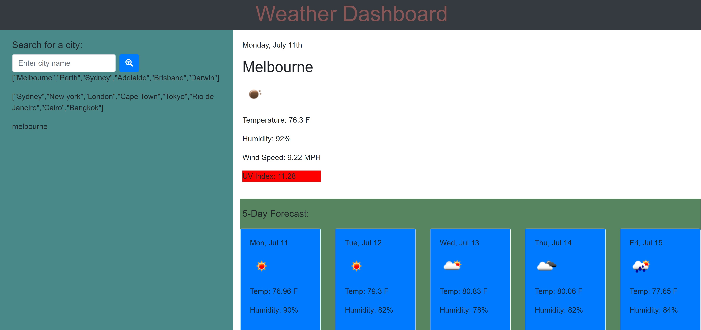

# Weather-Dashboard

## Description

A simple app which uses an external weather tracking API to populate the upcoming weather conditions for the next 5 days.

### Functionality

Type in the city you wish to observe the coming weekly weather.

### Technologies Used

JS, CSS & HTML.

### Directions for Future Development

Add favourites, user location functionality.

## Screenshot

## Links

[Link](https://michaelauricht.github.io/Weather-Dashboard/)